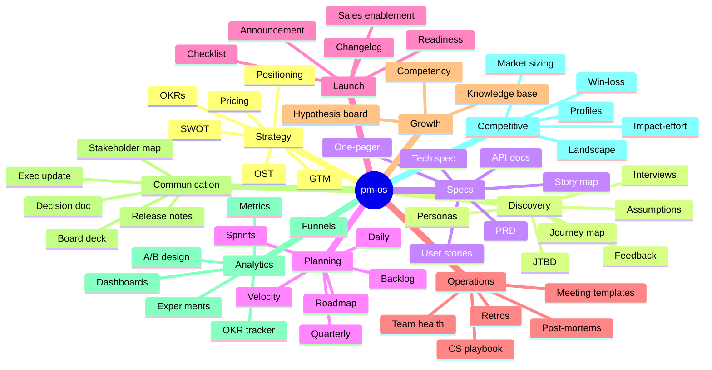
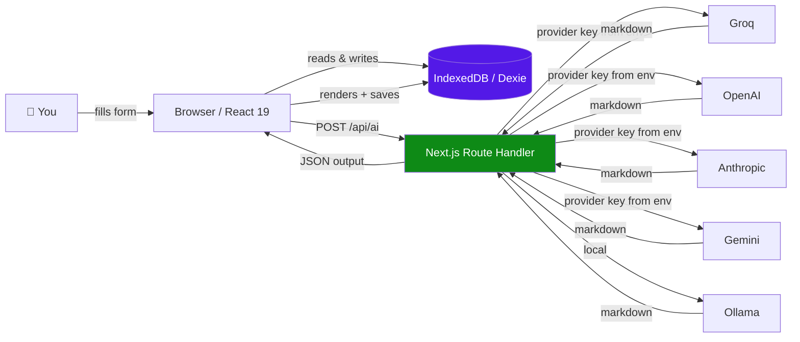

<div align="center">

# pm-os

**The Product Management Operating System**

82 AI-powered tools across 10 disciplines — strategy, discovery, specs, planning, launch, ops, growth, comms, analytics, competitive — all in one local-first, keyboard-driven workspace.

[](LICENSE)
[](https://nextjs.org)
[](https://react.dev)
[](https://tailwindcss.com)

<!-- screenshot: hero — home screen with sidebar + featured modules grid -->
<!-- Save as: docs/img/hero.png — recommended size 1600×900 -->


</div>

---

## What is pm-os

pm-os is the product management toolbox you've been duct-taping together out of Notion, Linear, Miro, Figma, Mixpanel, and a stack of Google Docs.

It packages **82 PM-specific workflows** — each one a guided form with a tuned LLM prompt — that turn a few bullet points into a polished, ready-to-share artifact:

- A PRD from a one-line idea
- An OKR set from a strategy bullet
- A persona from interview notes
- A competitive profile from a competitor name
- A release-readiness checklist from a launch date
- ...and 77 more

Everything lives in **your browser** (IndexedDB). Nothing leaves your machine except the LLM call when you click *Generate*. **Switch LLM providers** — Groq, OpenAI, Anthropic, Gemini, or local Ollama — without touching code.

---

## The 10 disciplines



Each module has a tuned prompt that follows the framework PMs already use (April Dunford for positioning, Teresa Torres for opportunity trees, Cooper for personas, Lenny's PRD template, etc.).

---

## How it works



- **Frontend** is a Next.js 16 app with React 19, Tailwind 4, shadcn/ui, Base UI, Framer Motion, and Recharts.
- **State** is split: Zustand for UI (palette, sidebar) and Dexie/IndexedDB for everything persistent.
- **AI** is a thin client → server-side API route → provider gateway. Keys live in environment variables on the server — never in the browser bundle.

---

## Quickstart

### 1. Clone

```bash
git clone https://github.com/avinashgaurav/pm-os.git
cd pm-os
npm install
```

### 2. Pick at least one LLM provider

Copy the env template and set **any one** key:

```bash
cp .env.example .env.local
```

Then edit `.env.local`:

```bash
# pick any one
GROQ_API_KEY=gsk_...           # https://console.groq.com/keys (free tier)
OPENAI_API_KEY=sk-...          # https://platform.openai.com/api-keys
ANTHROPIC_API_KEY=sk-ant-...   # https://console.anthropic.com/settings/keys
GOOGLE_API_KEY=...             # https://aistudio.google.com/apikey
OLLAMA_URL=http://localhost:11434  # if running Ollama locally
```

Providers without a key are greyed out in Settings. You can configure as many as you like and switch between them per-session.

### 3. Run

```bash
npm run dev
```

Open [http://localhost:3000](http://localhost:3000). Go to **Settings** → pick a provider + model → start generating.

<!-- screenshot: settings — provider picker showing 5 providers with availability badges -->


---

## A typical flow

<!-- screenshot: generate flow — module input form → generate button → AI output -->


1. Pick a module from the sidebar — say **Specs → PRD**.
2. Fill in the structured form (context, problem, goals, constraints, success metrics).
3. Click **Generate PRD**. The LLM follows the PRD framework prompt and produces a polished markdown doc.
4. Edit inline, export to markdown / PDF, or save as a snippet.
5. Open the **command palette** (`⌘K`) to jump to any of the other 81 modules without losing your place.

---

## Tech stack

| Layer | Tools |
|---|---|
| Framework | Next.js 16, React 19, TypeScript 5 |
| Styling | Tailwind 4, shadcn/ui, Base UI |
| State | Zustand (UI), Dexie / IndexedDB (persistence) |
| Animation | Framer Motion |
| Charts | Recharts |
| Drag-drop | dnd-kit |
| Command palette | cmdk |
| AI providers | Groq, OpenAI, Anthropic, Gemini, Ollama |
| Export | jsPDF + html2canvas, native Markdown |
| Deploy | Netlify (serverless functions via `@netlify/plugin-nextjs`) |

---

## Architecture

```mermaid
flowchart TB
    subgraph Browser
        UI[React UI<br/>shadcn + Base UI]
        Z[Zustand UI store]
        D[(Dexie<br/>IndexedDB)]
        AI[ai.ts<br/>client]
    end

    subgraph Server[Server / Netlify Function]
        R[/api/ai route]
        REG[Provider registry]
        P1[Groq]
        P2[OpenAI]
        P3[Anthropic]
        P4[Gemini]
        P5[Ollama]
    end

    UI <--> Z
    UI <--> D
    UI --> AI
    AI -->|POST /api/ai<br/>provider, model,<br/>system, user| R
    R --> REG
    REG --> P1 & P2 & P3 & P4 & P5
    style D fill:#5319e7,color:#fff
    style R fill:#0e8a16,color:#fff
```

- **Adding a provider** is one file: drop a module in `src/lib/providers/` and register it in the index.
- **Adding a module** is one route under `src/app/<category>/<slug>/page.tsx` plus a prompt entry in `src/lib/ai-prompts.ts`.
- **Adding a Dexie table** updates `src/lib/db.ts` with a new entity definition and a version bump.

See [docs/architecture.md](docs/architecture.md) (coming — tracked in [#29](https://github.com/avinashgaurav/pm-os/issues/29)) for the full deep dive.

---

## Project status

pm-os is **actively under construction**. The 82 modules work end-to-end today; what's being layered on now is polish, observability, sync, and richer editing. Track progress:

- **[Open issues](https://github.com/avinashgaurav/pm-os/issues)** — infrastructure & polish backlog (CI, tests, Sentry, Zod, exports…)
- **[Feature roadmap (#32)](https://github.com/avinashgaurav/pm-os/issues/32)** — 50 product/UX ideas across 9 themes (rich editor, backlinks, AI coach, integrations, multi-workspace…)

If you want to contribute, the easiest entry points are issues labeled `priority:low` or `area:docs`.

---

## Deploy

### Netlify (zero-config)

This repo is preconfigured for Netlify with `@netlify/plugin-nextjs`. Click below, then set your provider env vars in the Netlify UI under *Site settings → Environment variables*.

[](https://app.netlify.com/start/deploy?repository=https://github.com/avinashgaurav/pm-os)

### Vercel

[](https://vercel.com/new/clone?repository-url=https://github.com/avinashgaurav/pm-os)

### Self-host

Any Node host that runs Next.js will work — Render, Fly, Railway, or your own server. Set the provider env vars, run `npm run build && npm start`.

---

## Contributing

1. Fork & branch from `main`
2. Follow existing code style (Tailwind classes, shadcn patterns, Dexie hooks)
3. Run `npm run lint` and `npm run build` before pushing
4. Open a PR — describe the change, link to an issue if one exists

See [CONTRIBUTING.md](CONTRIBUTING.md) (coming — tracked in [#28](https://github.com/avinashgaurav/pm-os/issues/28)) for the full guide.

---

## Privacy

- **Your data lives in your browser.** IndexedDB on your device. Nothing is sent to any server except the LLM call when you click *Generate*.
- **Provider keys live on the server.** Your browser never sees them. The server forwards only the prompt to the chosen provider.
- **Export everything anytime.** Settings → Export All Data dumps every Dexie table to a JSON file you can back up or move to another device.

---

## Adding screenshots

Three image slots in this README still point at empty files in `docs/img/`:

- `docs/img/hero.png` — home screen with sidebar + featured modules grid (recommended 1600×900)
- `docs/img/settings-providers.png` — Settings page with 5 provider tiles (recommended 1200×800)
- `docs/img/generate-flow.png` — module form → generate → AI output (recommended 1600×900)

To capture: `npm run dev`, navigate, screenshot, save to `docs/img/`, commit.

---

## License

MIT — see [LICENSE](LICENSE).

Built by [@avinashgaurav](https://github.com/avinashgaurav) with the help of [Claude Code](https://claude.com/claude-code).
