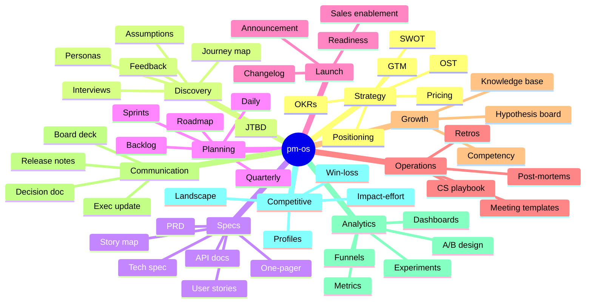
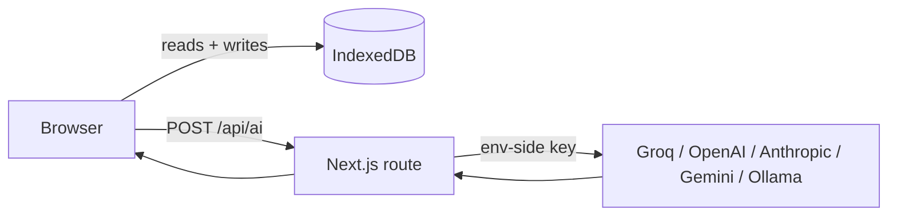

<div align="center">

# pm-os

**The Product Management Operating System**

82 AI-powered tools across 10 disciplines — strategy, discovery, specs, planning, launch, ops, growth, comms, analytics, competitive. Local-first, keyboard-driven.

[](LICENSE)
[](https://nextjs.org)
[](https://react.dev)
[](https://tailwindcss.com)


</div>

---

## What it does

pm-os replaces the Notion + Linear + Miro + Google Docs stack PMs duct-tape together.

82 PM-specific workflows — each a guided form with a tuned LLM prompt — turn a few bullet points into a polished, ready-to-share artifact: a PRD, an OKR set, a persona, a competitive profile, a release plan, and 77 more.

Everything lives in your browser (IndexedDB). The only thing that leaves your machine is the LLM call when you click *Generate*. Switch LLM providers — **Groq, OpenAI, Anthropic, Gemini, or local Ollama** — without touching code.

---

## The 10 disciplines



Each module follows the framework PMs already use (April Dunford for positioning, Teresa Torres for opportunity trees, Cooper for personas, Lenny's PRD template, etc.).

---

## Quickstart

```bash
git clone https://github.com/avinashgaurav/pm-os.git
cd pm-os
npm install
cp .env.example .env.local
```

Edit `.env.local` and set **any one** provider key:

```bash
GROQ_API_KEY=gsk_...           # free tier — https://console.groq.com/keys
OPENAI_API_KEY=sk-...          # https://platform.openai.com/api-keys
ANTHROPIC_API_KEY=sk-ant-...   # https://console.anthropic.com/settings/keys
GOOGLE_API_KEY=...             # https://aistudio.google.com/apikey
OLLAMA_URL=http://localhost:11434  # if running Ollama locally
```

Then run:

```bash
npm run dev
```

Open [http://localhost:3000](http://localhost:3000) → **Settings** → pick a provider + model → start generating. Providers without a key are greyed out.


---

## Architecture



- **Frontend:** Next.js 16, React 19, Tailwind 4, shadcn/ui, Base UI, Framer Motion, Recharts.
- **State:** Zustand for UI, Dexie/IndexedDB for everything persistent.
- **AI:** thin client → server-side `/api/ai` route → provider gateway. Keys live in env vars, never in the browser bundle.

Adding a provider is one file (`src/lib/providers/`). Adding a module is one route under `src/app/<category>/<slug>/page.tsx` + a prompt entry in `src/lib/ai-prompts.ts`. Full architecture deep-dive coming in [docs/architecture.md](docs/architecture.md) (tracked in [#29](https://github.com/avinashgaurav/pm-os/issues/29)).

---

## Deploy

[](https://app.netlify.com/start/deploy?repository=https://github.com/avinashgaurav/pm-os)
[](https://vercel.com/new/clone?repository-url=https://github.com/avinashgaurav/pm-os)

Set provider env vars in the host UI. For self-hosting, any Node host that runs Next.js works — `npm run build && npm start`.

---

## Status

Actively built. The 82 modules work end-to-end today; polish, sync, and richer editing are landing as separate PRs.

- **[Open issues](https://github.com/avinashgaurav/pm-os/issues)** — infrastructure backlog (CI, tests, Sentry, Zod, exports…)
- **[Feature roadmap (#32)](https://github.com/avinashgaurav/pm-os/issues/32)** — 50 product ideas (rich editor, backlinks, AI coach, integrations, multi-workspace…)

Contributions welcome. Start with issues labeled `priority:low` or `area:docs`.

---

## Privacy

Your data stays in your browser's IndexedDB. The only outbound request is the LLM call when you click *Generate*. Export everything anytime: **Settings → Export All Data**.

---

## License

MIT — see [LICENSE](LICENSE). Built by [@avinashgaurav](https://github.com/avinashgaurav).
